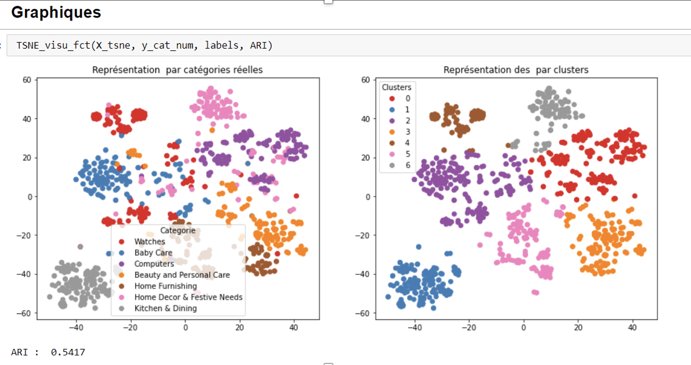
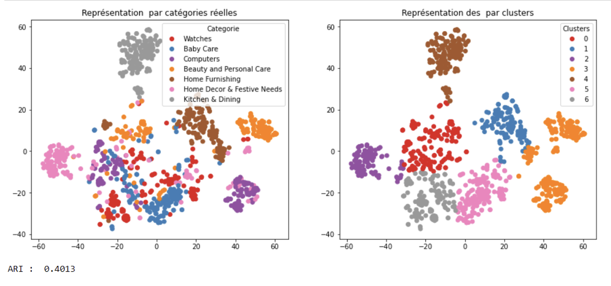

# Classifiez automatiquement des biens de consommation

## Projet6-Openclassrooms
&nbsp;
**Author:** Gulsum Kapanoglu
***

## Description de projet!

"Place de marché”, qui souhaite lancer une marketplace e-commerce.
Sur la place de marché, des vendeurs proposent des articles à des acheteurs en postant une photo et une description.
Pour l'instant, l'attribution de la catégorie d'un article est effectuée manuellement par les vendeurs, et est donc peu fiable. De plus, le volume des articles est pour l’instant très petit.

## Objectif 
Pour rendre l’expérience utilisateur des vendeurs (faciliter la mise en ligne de nouveaux articles) et des acheteurs (faciliter la recherche de produits) la plus fluide possible, et dans l'optique d'un passage à l'échelle, il devient nécessaire d'automatiser cette tâche.

Objectif est d'étudier la faisabilité d'un moteur de classification des articles en différentes catégories, avec un niveau de précision suffisant.

## Methodology
# Bag of word - Tf-idf

# Bert

## Pour plus d'informations
Veuillez consulter mon analyse complète dans [mon Jupyter Notebook](./Notebook.ipynb) ou ma [présentation](./Presentation.pdf). Pour toute question supplémentaire, veuillez contacter avec moi à gulsumkapanoglu@gmail.com.

Ce travail a été réalisé lors du projet 6 de ma formation Centrale Supèlec et OpenClassrooms de Data Scientist.

# Compétences évaluées

Prétraiter des données image pour obtenir un jeu de données exploitable
Prétraiter des données texte pour obtenir un jeu de données exploitable
Représenter graphiquement des données à grandes dimensions
Mettre en œuvre des techniques de réduction de dimension
Utiliser des techniques d’augmentation des données
Définir la stratégie de collecte de données en recensant les API disponibles
Définir la stratégie d’élaboration d’un modèle d'apprentissage profond
Évaluer la performance des modèles d’apprentissage profond selon différents critères
